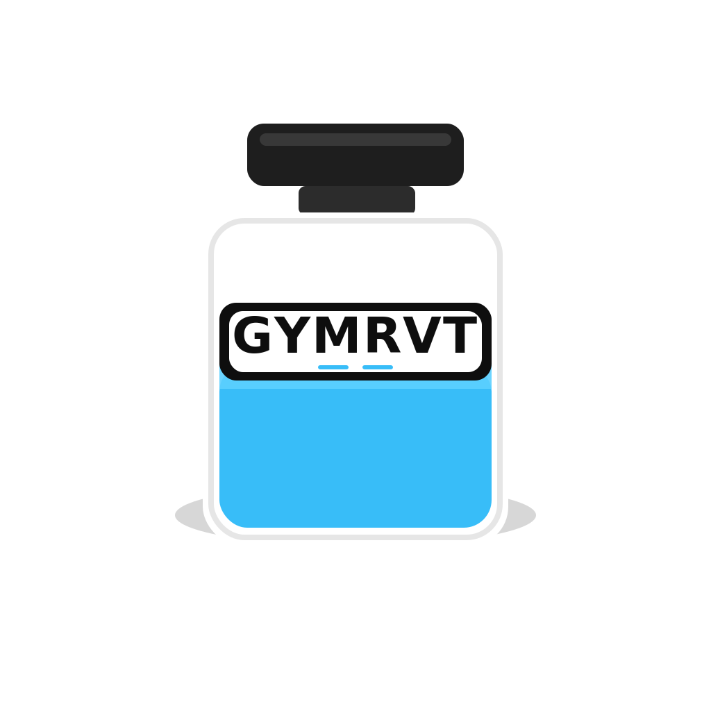

#  GYMRVT – AI-Powered Gym Companion

GYMRVT is a free, open-source mobile fitness app that turns your phone into a **real-time training partner**.  
No wearables. No subscriptions. Just computer vision, AI insights, and your own determination.  

---

##  Features

###  Smart Workout Tracking
- **Pose Estimation** with Google ML Kit.
- **Automatic Rep Counting** for squats, presses, curls, and more.
- **Tempo & Velocity Tracking** for bar speed and control.
- Runs **offline & fully on-device**.

###  Training Insights
- **1RM Estimator** using the Epley formula.
- **Workout Volume Tracking** (reps × weight).
- **Interactive Charts** for PRs, weekly volume, and long-term progress.

###  AI Photo Advisor
- Upload a **progress photo** and receive:
  - Likely **fatigued** or **underdeveloped muscle groups**.
  - Suggested **focus areas** for next workouts.
  - **Warnings** about imbalances or posture issues.
- Powered by **AI analysis** with fallback heuristics.

###  Profile & Personalization
- Save **name, age, gender, height, weight**.
- Track **weight history** with trends.
- Customize appearance with **background colors or images**.
- Add your **profile picture**.

###  Health App Integration
- Syncs with **Google Fit (Android)** and **Apple Health (iOS)**.
- Currently supports **weight, height, body fat %**.
- Future expansion: steps, calories, heart rate.

###  Workout Logging
- Create and log **custom exercises**.
- Track **sets, reps, and weights**.
- Automatically calculate **training volume**.
- Stored **locally** with future export options.

###  Modern UI
- **Clean dark mode** designed for the gym.
- **Bottom navigation** for quick access:
  - **Home** → Overview & trends
  - **Workout** → Log & track exercises
  - **Camera** → Real-time tracker or AI Advisor
  - **Profile** → Personal stats & settings

---

##  Why GYMRVT?

 **Open-source** – transparent & community-driven  
 **Private** – no forced accounts or data collection  
 **Accessible** – works on any phone, no wearables required  
 **AI-Enhanced** – personalized insights powered by modern AI  

---


---

##  Installation

### Prerequisites
- [Flutter SDK](https://flutter.dev/docs/get-started/install) (3.x)
- Android Studio or Xcode for building.

### Clone & Run
```bash
git clone https://github.com/yourusername/gymrvt.git
cd gymrvt
flutter pub get
flutter run